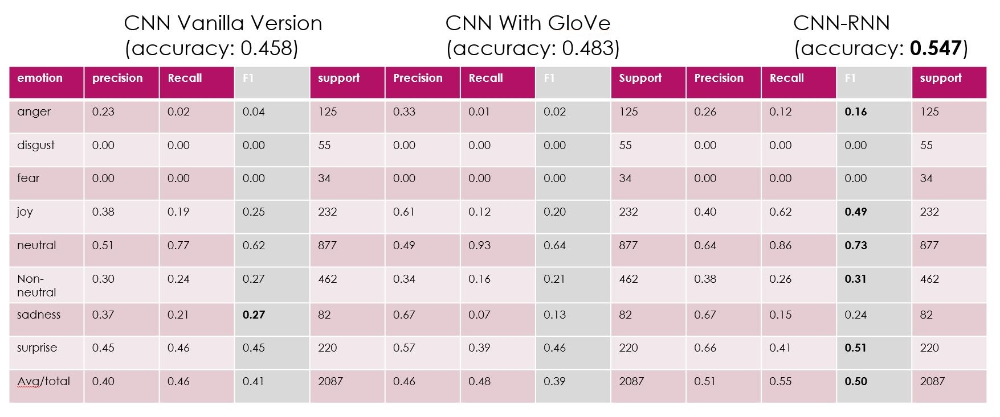
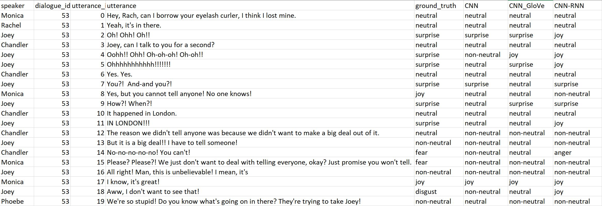

### Emotion Dection in Dialogues

#### Objective
In our project, our focus is on emotion detection in a dialogue. We take into account contextual information of an utterance within a dialgue, and propose a deep learning method to integrate such information into the training process.

#### Dataset
The corpus used in this project is introduced by Sheng-Yeh Chen el at.[1],  and consists of 800 dialogs extracted from the scripts of the famous TV show "Friends". According to Chen's paper, the scripts of seasons 1 to 9 of Friends TV shows are separated as episodes, and each episode consists of several dialogs. All the dialogs were categorized into four bins in terms of the number of the utterances in them. The ranges of the four bins are as follows,  [5, 9],
[10, 14], [15, 19], and [20, 24]. Then 250 dialogs were randomly chosen from each bin to form a dataset containing 1,000 dialogs. Then the dialog was tasked for emotion labeling through the Amazon Mechanic Turk (AMT). Human workers at the AMT was instructed to label each utterance using one of Ekman’s six basic emotions (1987) anger, disgust, fear, happiness, sadness, surprise, and an additional emotion, neutral emotion[2]. Although the original size of the dataset is 1,000 dialogues, the author only make 800 of them to the public. 

#### Models
1, CNN With Randomly Initialized Embeddings (Vanilla Version)  
2, CNN With Pre-Trained GloVe Word Vectors  
3, CNN-RNN with GloVe Word Vectors  

#### Experimental Results
 

The figure above shows precision, recall and F1 scores of CNN Vanilla, CNN with GloVe, and CNN-RNN respectively in terms of each emotion category and the overall score. CNN-RNN achieves the highest accuracy among all, around 0.064 higher than the CNN with GloVe model and 0.089 higher than the CNN Vanilla version. However, all of the three models have poor performance in detecting fear and disgust emotions. An obvious reason for that is that the dataset does not have enough data points from the two emotion categories, making it difficult for the models to learn from them. In order to better understand reasons behind their poor performance, we checked out their predictions on the test dataset in comparison to the ground truth labels. Figure 4 shows the evaluation results for Dialogue 53 in the test dataset. 
#### Observations
 

The ground truth labels are marked by human labors at Amazon Mechanic Turk. When we read these labels according to their corresponding utterances, we cannot make much sense out of it unless we watched the original TV show and understood the general context behind Dialogue 53. Fortunately, we are fans of Friends TV Show and have a good knowledge about what has happened before Dialogue 53. Briefly speaking, Chandler and Monica were having a secret romantic relationship since they attended the wedding ceremony of Ross and Emily in London. No friend of theirs knew it, but Joey just happened to find that Chandler was dating someone who had her/his eye lash left at their dating hotel. With such context in mind, the ground truth labeling of this dialogue makes more sense. We believe the human labors knew what had happened before Dialogue 53 when they labeled the dialogue's utterances. In another word, they have external information that is not contained within the dataset.  

Based on the above observation, another reason for poor performance of the models is that the dataset does not contain complete information that needed to correctly label an utterance's emotion.  

#### Conclusions and Future Work

In this project, we experimented three deep learning models to detect emotions within a dialogue. We found contextual information related to an utterance plays an important role in detecting the emotion embedded in the utterance as the CNN-RNN model achieves at least 6.4 percentages higher than any other models without using contextual information.   

Based on our observation of model performance on test dataset, we also realized the limitedness of the current dataset we are using in terms of quantity and quality. The dataset is too small for a deep learning model to learn sophisticated knowledge like human emotions. On the other hand, although the dataset is arranged in a hierarchical structure such that each utterance belongs to a dialogue, the utterance's emotion category cannot be decided without the help of expertise knowledge on the entire TV show. Human labors need to know backstage stories behind a dialogue before they label the utterances in it. Human labors can do it, but machines can not.  

Using textual data to detect emotions is still not good enough. In the future, we will try to integrate visual, audio and textual data to detect emotion within a scene. We will further develop the concept of contextual information with respect to a person's expression, which could be verbal or facial.  
